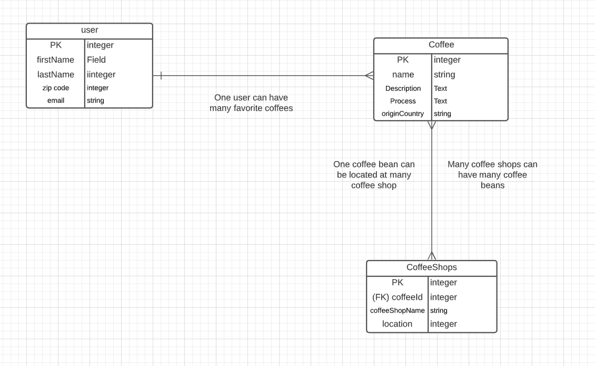
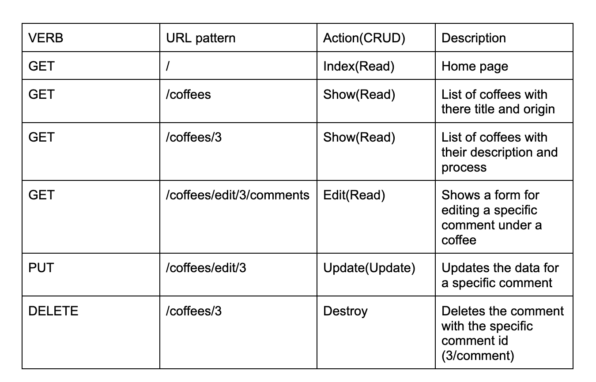

#projectTwoAssignment

My Coffee 

My Coffee is a place where you can learn about all the different kinds of coffee around the world. Here you can find the name and origin of the coffee. If a specific coffee catches your interest,
you can read about the process and how its made. Why stop there you can also add a specific coffee to your favorites so you can easily access them from one location. We also give you the ability to add comments under a specific coffee so other users can learn from you and each other. Maybe slip in some family secrets. 

Live Link: https://yene-buna.herokuapp.com/
_________________________________________________________________________________________________________________________________________________________________________________________________________

Tech Stack:

The My Coffee app was constructed using PostgresSQL, Express, Node.js, added Bootstrap and Font Awesome for styling
_________________________________________________________________________________________________________________________________________________________________________________________________________

Dependencies:

* NPM
* bcrypt
* connect-flas
* dotenv
* ej
* express
* express-ejs-layout
* express-session
* font-awesom
* method-overrid
* passport
* passport-loca
* pg
* sequelize

_________________________________________________________________________________________________________________________________________________________________________________________________________
ERD:

_________________________________________________________________________________________________________________________________________________________________________________________________________
RestFul Routes:

_________________________________________________________________________________________________________________________________________________________________________________________________________

MVP goals 
* Create data on different types of coffee
* User log in page
* Favorites coffee 
* Write post about how users make coffee

 _________________________________________________________________________________________________________________________________________________________________________________________________________
Stretch goals 
* Ability to search coffee shops
* Coffee of the week
* Highlight a small business coffee shop
* Blog of how people make there coffee 